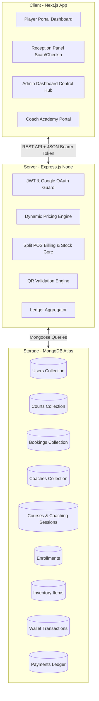

# Comprehensive Project Report: The Courtyard Digital Management Platform

**Date:** May 23, 2026  
**Version:** 2.0 (High-Fidelity Operations Polish)  
**Developer:** Antigravity AI Pair Programming  
**Target Platform:** Premium Pickleball & Racket Sports Venues  

---

## 1. Executive Summary
**The Courtyard** is an elite, full-stack venue management and Point-of-Sale (POS) platform designed to support premium pickleball and racket sports clubs. By integrating dynamic court reservations, an academic coaching portal, customized membership tiers, automated QR-based check-in systems, robust stock-aware inventory tracking, a master ledger, and a hybrid split-payment wallet, the platform streamlines operations for admins, receptionists, and coaches while presenting a modern, glassmorphic UI to players.

Key highlights of the system include:
*   **Aesthetic UI Design:** A premium dark-mode theme utilizing glassmorphic components, vibrant neon accents, sleek gradient backdrops, and subtle micro-animations that respond dynamically to user interactions.
*   **Enforced Guest Email Registration:** All spot checkouts at the reception desk require a validated guest email. This creates a placeholder profile, enabling transparent transactional histories. When the user eventually registers with their email, their past bookings and ledger items link automatically.
*   **Split Billing POS Engine:** Desk checkout automatically checks real-time inventory levels, deducts available funds from the player's club wallet, and processes the remaining balance via Cash or Card.
*   **Master Ledger Separation:** Checks paid via POS are dynamically separated into distinct transactional nodes (e.g., splitting court fees under `'Court Booking'` from amenities under `'Club Amenities'`) to isolate revenue sources in the master financial sheets.

---

## 2. Platform Architecture
The system employs a decoupled, client-server Architecture:



### 2.1. Frontend Stack
*   **Framework:** Next.js (built and compiled using modern ES Modules).
*   **Styling:** Custom TailwindCSS alongside global CSS rules tailored to provide rich premium glows, backdrop blur filters (`backdrop-blur-md`), and flexible layout grids.
*   **State Management:** Standard React Hooks (`useState`, `useEffect`, `useContext`) paired with native context providers to track persistent authentication status and user profile balances.

### 2.2. Backend Stack
*   **Environment:** Node.js paired with Express.js.
*   **Database Interface:** Mongoose ODM managing connections to MongoDB Atlas.
*   **Security:** JSON Web Tokens (JWT) for session management, standard `bcryptjs` for secure password hashing, and `google-auth-library` to process Google OAuth 2.0 payloads.

---

## 3. Database Schema & Models (Deep Dive)

The system manages fourteen distinct database models. Below are the precise schemas:

### 3.1. User Model (`User.js`)
Stores user profiles, access control roles, and ledger balances.
*   `name`: `String` (Required) — Full name of the player or staff.
*   `email`: `String` (Required, Unique) — Lowercased, trimmed contact address.
*   `password`: `String` (Required) — Hashed credentials.
*   `role`: `String` (Enum: `['user', 'admin', 'reception', 'coach']`, Default: `'user'`) — Access tier.
*   `membership`: `String` (Enum: `['None', 'Basic', 'Pro', 'Elite']`, Default: `'None'`) — Active membership.
*   `membershipExpiry`: `Date` — Date when the active subscription tier expires.
*   `walletBalance`: `Number` (Default: `0`) — Prepaid cash balance.
*   `tabBalance`: `Number` (Default: `0`) — Postpaid unpaid debt accumulated by the player.
*   `coach`: `ObjectId` (Ref: `'Coach'`) — Link to professional profile if role is set to `'coach'`.
*   `resetPasswordToken`: `String` / `resetPasswordExpires`: `Date` — Password recovery variables.
*   `isVerified`: `Boolean` (Default: `true`) — OTP verification flag.
*   `verificationCode`: `String` / `verificationCodeExpires`: `Date` — Email validation storage.
*   `isGoogleUser`: `Boolean` (Default: `false`) — Identifies Google OAuth sign-ups.
*   `hasCreatedPassword`: `Boolean` (Default: `true`) — Flags if password authentication is available.
*   `createdAt`: `Date` (Default: `Date.now`) — Account registration timestamp.

### 3.2. Court Model (`Court.js`)
Configures the physical booking resources.
*   `name`: `String` (Required) — Court label (e.g. "Indoor Glass Court A").
*   `surface`: `String` (Required) — Court construction material (e.g., "Acrylic Hardcourt").
*   `image`: `String` (Required) — Path/URL to dynamic high-definition cover graphic.
*   `description`: `String` — Detail text explaining specific court highlights.
*   `basePrice`: `Number` (Required) — Hourly rate charged during off-peak windows.
*   `peakPrice`: `Number` (Required) — Hourly rate charged during high-traffic times.
*   `isActive`: `Boolean` (Default: `true`) — Toggles court availability in reservation panels.

### 3.3. Booking Model (`Booking.js`)
Documents court reservation schedules.
*   `user`: `ObjectId` (Ref: `'User'`, Required) — Booking owner.
*   `court`: `ObjectId` (Ref: `'Court'`, Required) — Reserved court resource.
*   `date`: `String` (Required) — Target booking date formatted as `YYYY-MM-DD`.
*   `slots`: `[Number]` (Required) — Integer hours selected (e.g. `[9, 10]` implies 9:00 AM - 11:00 AM).
*   `totalAmount`: `Number` (Required) — Amount charged after applying peak-rates and member discounts.
*   `status`: `String` (Enum: `['pending', 'confirmed', 'cancelled']`, Default: `'confirmed'`).
*   `paymentId`: `String` — Transaction reference string.
*   `qrCodeData`: `String` (Required) — Stores the `bookingId` for instant reception desk scanning.
*   `checkedIn`: `Boolean` (Default: `false`) — Whether the booking QR has been scanned at check-in.
*   `createdAt`: `Date` (Default: `Date.now`).

### 3.4. Coach Model (`Coach.js`)
Profiles professional coaches.
*   `name`: `String` (Required) — Name of the coach.
*   `image`: `String` (Required) — Portrait URL.
*   `bio`: `String` (Required) — Background bio details.
*   `specialization`: `[String]` — Focus areas (e.g. `["Dinking", "Backhand Drives"]`).
*   `experience`: `Number` (Required) — Years of coaching.
*   `rating`: `Number` (Default: `5.0`) — Aggregated rating.
*   `pricePerSession`: `Number` (Required) — Hourly booking rate.
*   `commissionRate`: `Number` (Default: `70`) — Percentage of the booking fee kept by the coach.
*   `availability`: (Object)
    *   `days`: `[String]` (e.g. `["Monday", "Wednesday"]`).
    *   `hours`: `[Number]` (e.g. `[9, 10, 11, 14, 15]`).

### 3.5. Coaching Session Model (`CoachingSession.js`)
Registers individual lessons with coaches.
*   `user`: `ObjectId` (Ref: `'User'`, Required) — Enrolled player.
*   `coach`: `ObjectId` (Ref: `'Coach'`, Required) — Scheduled professional.
*   `programType`: `String` (Enum: `['Beginner Bootcamp', 'Intermediate Drill', 'Advanced Matchplay', 'Kids Program', 'Personal Training', 'Group Coaching']`, Required).
*   `date`: `String` (Required) — Format: `YYYY-MM-DD`.
*   `slot`: `Number` (Required) — 24-hour starting integer hour.
*   `amountPaid`: `Number` (Required).
*   `status`: `String` (Enum: `['scheduled', 'completed', 'cancelled']`, Default: `'scheduled'`).
*   `createdAt`: `Date` (Default: `Date.now`).

### 3.6. Academy Course Model (`Course.js`)
Contains multi-session academy curriculums.
*   `title`: `String` (Required) — Name of course program.
*   `description`: `String` (Required) — High-level syllabus description.
*   `duration`: `String` (Required) — Length description (e.g. "10 Days", "2 Months").
*   `startDate` / `endDate`: `String` (Required) — Program boundaries formatted as `YYYY-MM-DD`.
*   `price`: `Number` (Required) — Enrollment fee.
*   `slotsTotal`: `Number` (Required) — Class capacity limit.
*   `slotsEnrolled`: `Number` (Default: `0`) — Active enrollments tally.
*   `coach`: `ObjectId` (Ref: `'Coach'`, Required) — Course director.
*   `schedule`: `String` (Required) — Display details (e.g., "Mon, Wed, Fri @ 17:00-18:30").
*   `image`: `String` (Required) — Graphics header path.
*   `status`: `String` (Enum: `['upcoming', 'active', 'completed']`, Default: `'upcoming'`).
*   `createdAt`: `Date` (Default: `Date.now`).

### 3.7. Enrollment Model (`Enrollment.js`)
Registers multi-session course participants.
*   `user`: `ObjectId` (Ref: `'User'`, Required) — Enrolled player.
*   `course`: `ObjectId` (Ref: `'Course'`, Required) — Target academy course.
*   `amountPaid`: `Number` (Required) — Registration price.
*   `paymentId`: `String` (Required) — Billing transaction code.
*   `qrCodeData`: `String` (Required, Unique) — Format: `CY-ENROLL-${courseId}-${userId}`.
*   `enrolledAt`: `Date` (Default: `Date.now`).
*   `status`: `String` (Enum: `['active', 'cancelled', 'completed']`, Default: `'active'`).
*   `attendance`: `[String]` — Array of checked-in attendance dates (`YYYY-MM-DD`).
*   `progressLogs`: `[Object]` — Cumulative skill reviews written by coaches:
    *   `date`: `String` (Required).
    *   `remarks`: `String` — Qualitative notes.
    *   `skills`: (Object, graded `1` to `5`)
        *   `footwork` / `serve` / `dinking` / `backhand` / `stamina`
    *   `recordedBy`: `ObjectId` (Ref: `'User'`) — Submitting coach profile ID.

### 3.8. Inventory Item Model (`InventoryItem.js`)
Tracks the club's pro-shop stock and amenities.
*   `name`: `String` (Required, Unique) — Product identifier (e.g., `'Racket Rental'`, `'Premium Water'`).
*   `price`: `Number` (Required) — Per-unit purchase price.
*   `stock`: `Number` (Required, Default: `0`) — Count of units physically in inventory.
*   `isActive`: `Boolean` (Default: `true`) — Toggles listing in POS checkout dropdown lists.
*   `createdAt`: `Date` (Default: `Date.now`).

### 3.9. Wallet Transaction Model (`WalletTransaction.js`)
Maintains a detailed audit log of all club wallets.
*   `user`: `ObjectId` (Ref: `'User'`, Required) — Affected profile.
*   `amount`: `Number` (Required) — Float value (Positive: Credits/Topups; Negative: Debits/Charges).
*   `type`: `String` (Enum: `['topup', 'court_booking', 'coaching_enrollment', 'spot_billing', 'refund']`, Required).
*   `description`: `String` (Required) — Explanation (e.g., "Premium Water x2").
*   `paymentMethod`: `String` (Enum: `['wallet', 'cash', 'card', 'tab']`, Required).
*   `processedBy`: `ObjectId` (Ref: `'User'`) — Staff member processing the transaction.
*   `createdAt`: `Date` (Default: `Date.now`).

### 3.10. Payment Model (`Payment.js`)
Monitors high-level operational cash inflows.
*   `user`: `ObjectId` (Ref: `'User'`, Required) — Billing customer.
*   `amount`: `Number` (Required) — Net currency value received.
*   `type`: `String` (Enum: `['Court Booking', 'Coaching Session', 'Coaching Course', 'Membership', 'Club Amenities']`, Required).
*   `referenceId`: `ObjectId` (Required) — Connects payment to booking, enrollment, or wallet transaction.
*   `razorpayOrderId` / `razorpayPaymentId`: `String` — Standard online processor IDs.
*   `paymentMethod`: `String` (Enum: `['cash', 'card', 'wallet', 'tab', 'online', 'split']`, Default: `'online'`).
*   `status`: `String` (Enum: `['pending', 'success', 'failed']`, Default: `'pending'`).
*   `createdAt`: `Date` (Default: `Date.now`).

---

## 4. Key Platform Features & Core Algorithms

### 4.1. The Pricing & Discount Engine
When booking a court, the pricing engine applies custom peak-rate calculations and user membership discount matrices.

1.  **Peak Hours Definition:** High-traffic slots are configured daily between **6:00 AM - 9:00 AM** and **5:00 PM - 10:00 PM** (slots: `6, 7, 8` and `17, 18, 19, 20, 21`).
2.  **Base Pricing Configuration:** Each court holds its own `basePrice` (off-peak) and `peakPrice` rates.
3.  **Membership Discount Matrix:**
    *   **None:** No discount (100% of calculated total).
    *   **Basic Tier:** 10% discount on final total.
    *   **Pro Tier:** 25% discount on final total.
    *   **Elite Tier:** 100% free courts (0 price booked under their session).

```javascript
// Dynamic Hourly Price Computation Algorithm
let totalAmount = 0;
slots.forEach(slot => {
  const isPeak = (slot >= 6 && slot < 9) || (slot >= 17 && slot < 22);
  totalAmount += isPeak ? court.peakPrice : court.basePrice;
});

let discountRate = 0;
if (user.membership === 'Basic') discountRate = 0.10;
else if (user.membership === 'Pro') discountRate = 0.25;
else if (user.membership === 'Elite') discountRate = 1.00;

const discountAmount = totalAmount * discountRate;
const finalPrice = totalAmount - discountAmount;
```

---

### 4.2. POS Split-Payment Checkout Algorithm
The POS Spot Billing endpoint (`/api/admin/wallet/charge`) processes split payments for customers who want to pay partially with their wallet and pay the remainder using cash or card.

```
[Start POS Spot Billing Process]
              │
              ▼
    Validate User Identity
(If userId == 'guest', check email.
  Provision placeholder User)
              │
              ▼
     Loop through items:
- Check Court slots overlap availability
- Verify Inventory stock levels (stock >= qty)
              │
              ▼
   Compute Total Cart Value (A)
              │
              ▼
     Is useWallet enabled?
     ├── YES ──► Deduct Wallet portion = Min(user.walletBalance, A)
     │           Generate WALLET transaction audit log.
     │           Set Cart Remainder B = A - Wallet portion
     └── NO ───► Set Cart Remainder B = A
              │
              ▼
        Net Charge B > 0?
     ├── YES ──► Pay B via paymentMethod (Cash, Card, or Tab)
     │           Verify tab limit / check cash drawer
     └── NO ───► Process Complete (Wallet fully covered cost)
              │
              ▼
  Deduct Inventory Items stock levels
              │
              ▼
Generate Master Ledger Split Payment Records:
- Splitting Court Booking items into 'Court Booking' Payment node
- Splitting shop items into 'Club Amenities' Payment node
              │
              ▼
   [Instantiate Confirmed Bookings]
```

#### Code Implementation (`server.js` Extract):
```javascript
let walletDeduction = 0;
if (req.body.useWallet && userId !== 'guest') {
  walletDeduction = Math.min(user.walletBalance || 0, total);
  user.walletBalance = (user.walletBalance || 0) - walletDeduction;
  
  if (walletDeduction > 0) {
    const walletTx = new WalletTransaction({
      user: user._id,
      amount: -walletDeduction,
      type: 'spot_billing',
      description: `Split Wallet portion: ${itemsDescription}`,
      paymentMethod: 'wallet',
      processedBy: req.user.id
    });
    await walletTx.save();
  }
}

const netCharge = total - walletDeduction;
if (netCharge > 0) {
  if (paymentMethod === 'wallet') {
    if ((user.walletBalance || 0) < netCharge) {
      return res.status(400).json({ error: 'Insufficient wallet balance.' });
    }
    user.walletBalance = (user.walletBalance || 0) - netCharge;
  } else if (paymentMethod === 'tab') {
    user.tabBalance = (user.tabBalance || 0) + netCharge;
  }
}
await user.save();
```

---

### 4.3. Unified Ledger Integration
To provide a consolidated view of the club's finances, the master ledger merges and normalizes two separate transaction streams: online/desk payments (`Payment` schema) and prepaid wallet adjustments (`WalletTransaction` schema).

```javascript
// normalizes Payment entries
const paymentTxList = payments.map(p => {
  let method = p.paymentMethod || 'online';
  if (method === 'online') {
    const pid = (p.razorpayPaymentId || '').toLowerCase();
    if (pid.includes('wallet')) method = 'wallet';
    else if (pid.includes('cash')) method = 'cash';
    else if (pid.includes('split')) method = 'split';
    else if (pid.includes('tab')) method = 'tab';
    else method = 'card';
  }
  
  return {
    _id: p._id,
    createdAt: p.createdAt,
    user: p.user,
    description: `${p.type} checkout (${p.user?.name || 'Guest'})`,
    paymentMethod: method,
    amount: p.amount
  };
});

// normalizes WalletTransaction entries
const walletUnifiedList = walletTx.map(w => ({
  _id: w._id,
  createdAt: w.createdAt,
  user: w.user,
  description: w.description || `${w.type.toUpperCase()} (Wallet)`,
  paymentMethod: 'wallet',
  amount: w.amount
}));

// merges and sorts chronologically
const unifiedTransactions = [...paymentTxList, ...walletUnifiedList].sort(
  (a, b) => new Date(b.createdAt) - new Date(a.createdAt)
);
```

---

### 4.4. QR Code & Attendance Check-In Verification Engine
The check-in system decodes scanned QR payloads. It distinguishes between standard court bookings and academy enrollments, updating records in real time.

```javascript
// Scan verification endpoint (/api/admin/scan-qr)
if (qrCode.startsWith('CY-ENROLL-')) {
  // 1. Academy Check-In
  const enrollment = await Enrollment.findOne({ qrCodeData: qrCode }).populate('course user');
  if (!enrollment) return res.status(404).json({ error: 'Enrollment not found' });
  
  const isValid = enrollment.status === 'active';
  const today = new Date().toISOString().split('T')[0];
  
  if (isValid && !enrollment.attendance.includes(today)) {
    enrollment.attendance.push(today);
    await enrollment.save();
    // Dispatch system alert notification to user dashboard
  }
} else {
  // 2. Standard Court Booking Check-In
  const booking = await Booking.findOne({ qrCodeData: qrCode }).populate('court user');
  if (!booking) return res.status(404).json({ error: 'Booking not found' });
  
  const today = new Date().toISOString().split('T')[0];
  const canCheckIn = booking.status === 'confirmed' && booking.date >= today;
  
  if (canCheckIn && !booking.checkedIn) {
    booking.checkedIn = true;
    await booking.save();
    // Dispatch system alert notification to user dashboard
  }
}
```

---

## 5. Front-End Interface Design (UX Showcase)
The frontend uses a modern, high-contrast dark theme. Key pages feature visual enhancements designed to improve the user experience:

*   **Glassmorphic Container Styling:** High-end translucent panels (`glass-panel`) utilizing backdrop filters, light borders (`border-white/10`), and dark backdrops (`bg-zinc-950/70`) that keep UI clean and readable.
*   **Vibrant Accent Coloring:** Theme accents use specific neon color variables:
    *   `text-neon-green` (`#39FF14`) — Active indicators, credits, and successful transactions.
    *   `bg-neon-blue` (`#00F0FF`) — Visual call-to-actions, booking panels, and buttons.
    *   `text-neon-pink` (`#FF007F`) — Warnings, debits, and cancellations.
*   **Interactive Controls & Selectors:**
    *   **Time Slots:** Clicking interactive, color-coded blocks switches time slots between *Available* (zinc background), *Booked* (dark background with pink warning diagonal bars), and *Selected* (neon glow background).
    *   **Dynamic Amenities Selector:** Traditional dropdown selections have been replaced by list-based, itemized catalog components. Receptionists can search through active items, view real-time stock levels, and add items to the cart with one click.
    *   **Dashboard Indicators:** A split display tracks wallet balances (`₹X` in neon green) and postpaid tabs (`₹Y` in neon pink) side by side.

---

## 6. Complete API Endpoint Inventory

| Method | Endpoint | Access Level | Description |
| :--- | :--- | :--- | :--- |
| **POST** | `/api/auth/signup` | Public | Registers a new account, claims placeholder guest profiles, and prints a simulated OTP code. |
| **POST** | `/api/auth/login` | Public | Validates credentials, checks OTP verification, and returns a bearer token. |
| **POST** | `/api/auth/google` | Public | Authenticates Google accounts and claims guest placeholder data if available. |
| **POST** | `/api/auth/verify-email` | Public | Validates OTP codes to activate accounts and trigger welcome notifications. |
| **POST** | `/api/auth/forgot-password`| Public | Dispatches password reset links. |
| **POST** | `/api/auth/reset-password` | Public | Updates user credentials using verified reset tokens. |
| **GET** | `/api/auth/me` | Authenticated | Retrieves current profile details. |
| **GET** | `/api/courts` | Public | Returns a list of active courts. |
| **GET** | `/api/courts/availability`| Public | Fetches booked slots for a given court and date. |
| **POST** | `/api/bookings` | Authenticated | Processes new court bookings, applying pricing and membership discounts. |
| **GET** | `/api/bookings/my` | Authenticated | Returns a history of the user's court bookings. |
| **POST** | `/api/bookings/cancel/:id`| Authenticated | Cancels a booking and issues a cancellation alert. |
| **GET** | `/api/coaching/coaches` | Public | Lists available coaches. |
| **POST** | `/api/coaching/book` | Authenticated | Books individual coaching lessons. |
| **GET** | `/api/coaching/my` | Authenticated | Retrieves a history of the user's individual coaching lessons. |
| **GET** | `/api/coaching/courses` | Public | Lists active/upcoming Academy courses. |
| **POST** | `/api/coaching/enroll` | Authenticated | Enrolls a player in an Academy course. |
| **GET** | `/api/coaching/my-enrollments`| Authenticated | Lists active course enrollments for the logged-in player. |
| **POST** | `/api/memberships/buy` | Authenticated | Upgrades the user's membership tier. |
| **GET** | `/api/tournaments` | Public | Lists active tournaments. |
| **POST** | `/api/tournaments/register/:id`| Authenticated | Registers the player for a tournament. |
| **GET** | `/api/notifications` | Authenticated | Returns system notifications, including automated upcoming booking reminders. |
| **GET** | `/api/payments/my-ledger` | Authenticated | Returns a list of the player's payments and wallet transactions. |
| **POST** | `/api/users/settle-tab` | Authenticated | Settles outstanding postpaid tabs using wallet funds or card payments. |
| **POST** | `/api/users/wallet/topup` | Authenticated | Processes online wallet top-ups. |
| **GET** | `/api/admin/analytics` | Admin Only | Compiles operational statistics, revenue summaries, and court utilization rates. |
| **GET** | `/api/admin/users` | Reception/Admin | Lists all registered user profiles. |
| **GET** | `/api/admin/bookings` | Reception/Admin | Lists all court bookings (receptionists see bookings with prices hidden). |
| **POST** | `/api/admin/bookings/cancel/:id`| Admin Only | Cancels bookings from the administrative panel. |
| **GET** | `/api/admin/coaching` | Reception/Admin | Lists all individual coaching session bookings. |
| **POST** | `/api/admin/block-slot` | Reception/Admin | Blocks court slots for scheduled maintenance. |
| **POST** | `/api/admin/promo` | Admin Only | Broadcasts system-wide announcements. |
| **GET** | `/api/admin/courts` | Admin Only | Returns all court profiles (including inactive ones) for CRUD actions. |
| **POST** | `/api/admin/courts` | Admin Only | Creates new courts. |
| **PUT** | `/api/admin/courts/:id` | Admin Only | Modifies court details (pricing, naming, description, and status). |
| **DELETE**| `/api/admin/courts/:id` | Admin Only | Deletes court profiles. |
| **POST** | `/api/admin/coaches` | Admin Only | Profiles new coaching personnel. |
| **PUT** | `/api/admin/coaches/:id`| Admin Only | Modifies coach details (availability, commission rates, and bio information). |
| **DELETE**| `/api/admin/coaches/:id`| Admin Only | Deletes coach profiles. |
| **GET** | `/api/admin/courses` | Reception/Admin | Lists all Academy courses. |
| **POST** | `/api/admin/courses` | Admin Only | Launches new Academy courses. |
| **PUT** | `/api/admin/courses/:id`| Admin Only | Modifies Academy course details, rescheduling notifications to active students. |
| **DELETE**| `/api/admin/courses/:id`| Admin Only | Deletes Academy courses. |
| **POST** | `/api/admin/tournaments`| Admin Only | Launches new tournaments. |
| **PUT** | `/api/admin/tournaments/:id`| Admin Only | Updates tournament details, entry parameters, status, and winners. |
| **DELETE**| `/api/admin/tournaments/:id`| Admin Only | Deletes tournament records. |
| **PUT** | `/api/admin/users/:id` | Admin Only | Modifies user profiles (role modifications, custom membership overrides). |
| **DELETE**| `/api/admin/users/:id` | Admin Only | Deletes user accounts. |
| **GET** | `/api/admin/enrollments`| Reception/Admin | Lists all student course enrollments. |
| **POST** | `/api/admin/enrollments`| Reception/Admin | Manually registers students in Academy courses at the desk. |
| **PUT** | `/api/admin/enrollments/:id`| Reception/Admin | Modifies active course enrollments and records manual attendance. |
| **DELETE**| `/api/admin/enrollments/:id`| Admin Only | Deletes course enrollments. |
| **POST** | `/api/admin/scan-qr` | Reception/Admin | Scans check-in passes, verifying bookings and marking attendance. |
| **GET** | `/api/admin/settings` | Authenticated | Fetches global system settings (e.g., dynamic GST/Tax rates). |
| **POST** | `/api/admin/settings` | Admin Only | Updates global tax settings. |
| **POST** | `/api/admin/wallet/topup`| Reception/Admin | Tops up a user's wallet balance from the desk using Cash or Card. |
| **POST** | `/api/admin/wallet/charge`| Reception/Admin | Dynamic spot checkout (enforces guest emails, handles split payments, and manages stock). |
| **GET** | `/api/admin/wallet/transactions/:userId`| Authenticated | Lists wallet transaction logs for a specific player. |
| **GET** | `/api/admin/users/:id/balance`| Authenticated | Retrieves current wallet and tab balances for a specific player. |
| **POST** | `/api/admin/wallet/refund-override`| Admin Only | Processes administrative overrides to credit cash back to a user's wallet. |
| **GET** | `/api/admin/ledger` | Admin Only | Merges cash payments and wallet debits into a single unified ledger stream. |
| **POST** | `/api/coach/progress` | Coach/Admin | Records course lesson progress remarks and skills evaluations. |
| **GET** | `/api/coach/my-students`| Coach Only | Returns a list of courses and students assigned to the logged-in coach. |
| **GET** | `/api/admin/coaching/quality-control`| Reception/Admin | Generates Academy attendance and course capacity reports. |
| **GET** | `/api/admin/inventory` | Reception/Admin | Lists active and inactive inventory items. |
| **POST** | `/api/admin/inventory`| Admin Only | Creates new inventory items. |
| **PUT** | `/api/admin/inventory/:id`| Admin Only | Updates inventory details (pricing, name, and stock levels). |
| **DELETE**| `/api/admin/inventory/:id`| Admin Only | Deletes inventory items from the system. |

---

## 7. Operational Workflows & Edge Cases

### 7.1. Seamless Guest Upgrades
1.  **Desk Interaction:** A walk-in customer books a court and rents a racket at reception. They pay cash.
2.  **Email Enforced:** The receptionist enters their email (`john.doe@gmail.com`) and charges their POS cart.
3.  **Account Provisioning:** The backend checks if `john.doe@gmail.com` exists. It doesn't, so it creates a placeholder profile with `hasCreatedPassword = false` and registers the transactions.
4.  **Registration Linkage:** A few days later, John opens the website and clicks 'Sign Up' using `john.doe@gmail.com`.
5.  **Claiming Ledger Data:** The signup endpoint detects the existing email, saves their new password, updates `hasCreatedPassword = true`, and links their transaction history. Their new dashboard instantly displays all previous bookings, wallet logs, and ledger items.

```
Guest Checkout at Desk (Provide email: guest@mail.com)
            │
            ▼
Server auto-provisions placeholder User (password is randomized, isVerified: false)
            │
            ▼
Transactions stored under this placeholder profile
            │
            ▼
Guest signs up on Web using same email (guest@mail.com)
            │
            ▼
Account claimed: Password saved, isVerified: true, hasCreatedPassword: true
            │
            ▼
All previous desk bookings and ledger logs linked automatically!
```

### 7.2. Double-Booking Prevention & Concurrency Protection
To prevent two players from booking the same court or coach for the same slot, the backend runs a strict concurrency check before processing transactions:

1.  **Occupancy Scan:** Before saving a booking, the system queries the database:
    `Booking.find({ court: courtId, date, status: 'confirmed' })`
2.  **Overlap Analysis:** The system maps the array of requested hour slots against existing bookings. If any slot matches, the transaction is rejected with a conflict error (`400`).
3.  **POS Double Checks:** This verification is repeated during spot bill checkouts to block the cart if a conflicts occurred since the items were added.
4.  **Coach Availability:** Coaching requests query `CoachingSession` database collections:
    `CoachingSession.findOne({ coach: coachId, date, slot, status: 'scheduled' })`
    This ensures coaches cannot be booked for overlapping individual sessions.

---

## 8. Technical Specifications & Deployment

### 8.1. Configuration Directory Structure
*   `/the-courtyard/backend/` — Express API codebase.
    *   `/models/` — Containing all 14 Mongoose Schema declarations.
    *   `server.js` — Core router, controller logic, POS processing engines, and database configurations.
    *   `seed.js` — Automated database seed scripts.
*   `/the-courtyard/frontend/` — Next.js SPA codebase.
    *   `/src/app/` — Application page directories.
        *   `/admin/page.js` — Consolidated operational dashboard (Analytics HUD, POS workspace, Inventory tracking, ledgers).
        *   `/bookings/` — Front-facing interactive court reservation panels.
        *   `/coaching/` — Customer enrollment dashboards for academy programs.
        *   `/dashboard/` — Standard customer portal dashboard.
        *   `page.js` — The platform landing page.
    *   `next.config.mjs` — Next framework configurations.

### 8.2. Environment Configurations
Secure setup requires configuring the following environment variables:

**Backend Environment Variables (`backend/.env`):**
```ini
MONGODB_URI=mongodb+srv://<username>:<password>@cluster.mongodb.net/the-courtyard?retryWrites=true&w=majority
PORT=5000
JWT_SECRET=the_courtyard_jwt_secret_key_2026_premium
```

**Frontend Environment Variables (`frontend/.env.local`):**
```ini
NEXT_PUBLIC_API_URL=http://localhost:5000
```

---

*Report prepared by Antigravity AI pair programming. Verified compatible with Next.js v16+ and MongoDB Server v7+.*
